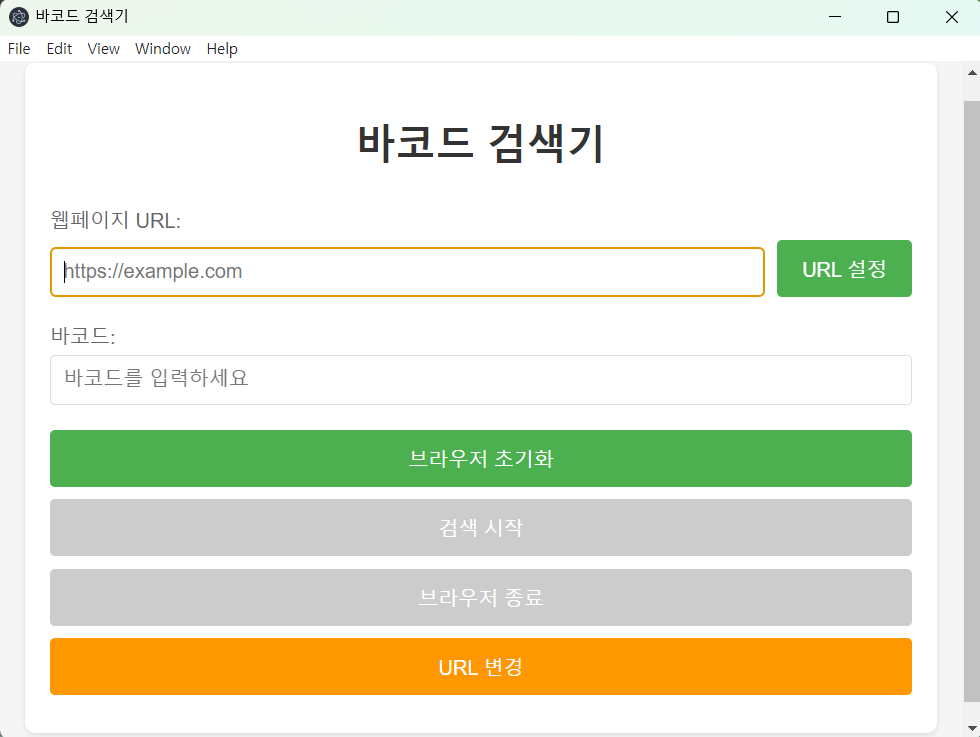

# 등록번호 검색기

## 프로젝트 배경

### 1. 바코드 리더기 작동방식

바코드 리더기를 통해서 도서관 책의 등록번호를 인식하면 실제로 책 바코드에 적힌 것과는 다르게 자릿수가 더 길게 나오게 됩니다.  
현재 도서관에서 사용하는 바코드 방식은 UPC-A로 12자리 숫자와 문자 조합을 사용합니다.
그러나 책과 시스템에서 실질적으로 필요로 하는 자릿수는 8자리로 된 숫자와 문자 조합이죠.
그래서 단순히 웹브라우저 상에서 문서 내 일치하는 단어 찾기 기능으로는 책의 등록번호를 검색할 수 없습니다.

### 2. UX 리서치

같이 일하는 도서관 직원들을 대상으으로 이 문제가 개선이 필요한지를 조사했습니다.

관찰 연구를 통해서 이 문제로 불편을 겪고 있는게 맞는지, 포커스 그룹 인터뷰를 통해서 불편함이 견딜만한 수준이라고 생각하는지를 파악했습니다.
탐색적 리서치로 사용 중인 프로그램 상에서 겪고 있는 불편함을 확인했고 개선이 필요하다고 생각했습니다.

#### 문제점

이 문제는 크게 두 가지 포인트로 나눠서 해결방안을 생각해야했습니다.

- 프로그램 상 문제점

  도서관에서 운영하는 "상호대차"라는 서비스를 위해서 프로그램 상 크게 네 개의 다른 탭을 구성하고 그 하위 탭이 하나씩 더 있는데, 상위 탭에는 input이 있고 하위 탭에는 input이 없습니다.
  그래서 상위 탭에서는 도서 등록번호 검색이 가능하지만, 하위 탭에서는 검색이 불가능한 문제가 발생합니다.
  하지만 하루에도 수백권의 책이 오가는 도서관 특성 상 중복 확인이 꼭 필요하기 때문에 하위 탭에서도 도서 등록번호로 검색이 꼭 필요한데 input이 없어 불편을 겪게 되었습니다.

- 운영 권한 문제점

  도서관에서 자체 개발한 프로그램이 아닌 개발사가 따로 있어서 이와 같은 문제로 불편을 겪고 있음을 전달했으나, 개발사 사정으로 해당 문제가 해결되기 어려웠습니다.
  프로그램 사용자 입장에서는 개선이 시급한 상황이었지만 해결이 어려운 상황이었습니다.

결국 개발사 측에서 이 문제를 당장 해결해주지 않았기 때문에 이 프로젝트를 통해서 불편을 해소하고자 하였습니다.

## 프로젝트 기획

UX 리서치를 통해서 설정한 방향성은 이와 같습니다.

> 웹 기반으로 개발된 프로그램에 개입하지 않으면서 원하는 기능만을 달성한다.

그래서 생각한 초기 개발 방향은 JavaScript 프레임워크 중 Puppeteer를 활용해 데이터를 추출하는 방식으로 설정했습니다.
로그인 정보와 타깃 URL을 입력하면 해당 URL로 이동해서 로그인 후 확인이 필요한 등록번호 데이터를 추출하는 플로우를 기획했고, electron을 활용해 네이티브 애플리케이션으로 개발하고자 했습니다.

개발할 기능은 크게 두 가지로 바코드를 인식해 원하는 자릿수로 구성하는 것과 구성된 바코드 등록번호로 테이블을 검색하는 것이었습니다. 개발할 기능이 크게 어렵지 않고 복잡하지 않기 때문에 다른 프레임워크를 사용하기보다 HTML과 JS만으로 개발하기로 했습니다.

### 1차 이슈 발생

화면 개발과 메인 기능 두 가지를 개발한 후 화면 테스트를 해보니 생각지 못한 이슈가 있었습니다.

첫번째로 매번 새로운 창이 열리고 로그인부터 타깃 URL까지 이동하는 과정을 거친다는 것이었습니다. 기획했던 건 창이 한 번만 열리고, 타깃 URL에서 계속 검색을 진행하는 것이었지만 생각과는 다르게 검색 키워드를 넣을 때마다 자동화 과정이 새로 생성된다는 문제가 발생했습니다.

두번째로 개발한 프로그램이 작동할 프로그램이 웹 기반이기 때문에 굳이 OS 네이티브 애플리케이션일 필요가 없다는 점이었습니다. 첫번째 문제점과 연결 지어 생각해봤을 때 다른 환경에서 애플리케이션이 작동해도 될 것 같다는 결론을 내렸습니다.

그래서 크롬 확장 프로그램으로 필요한 때만 프로그램을 사용하도록 하도록 개발 방향을 변경했습니다.

## 프로그램 개발

### manifest.json 작성

크롬 확장 프로그램은 `manifest.json` 파일을 통해 프로그램 데이터를 확인하게 됩니다. 그래서 프로그램이 인식되기 위해 필요한 내용들을 작성했고, 버전 관리와 파비콘 관리, 그리고 content script 오류 관리를 이 파일로 할 수 있었습니다.

#### 관련 이슈

`mainfest.json`과 관련된 이슈들은 대부분 `content script` 이슈였으며 다양한 원인으로 인해 발생했습니다.

1. 옵션(permissions, host permission) 오류: storage 등 웹 브라우저 기능을 활용하기 위해서 permissions 옵션에 추가해야하는데, 누락되었을 경우 오류가 발생합니다.
2. 백그라운드 서비스 워커 오류: `background.js` 파일이 제대로 옵션에 추가되지 않았을 경우 오류가 발생합니다.
3. 모듈 import 오류: ES6 문법을 지원하지 않아 모듈화된 파일은 임포트해서 사용할 수 없어 오류가 발생합니다.
4. 기타 CSP 오류

### background.js

초기 기능 개발에서는 필요하지 않았으나 웹 브라우저 기능 중 세션과 탭 감지가 필요해서 사용하였습니다.
확장 프로그램이 활성화된 탭을 감지해 ID를 저장하고 그 탭의 상태가 변경되었을 때 프로그램의 상태도 변경되도록 개발했습니다.

#### 관련 이슈

1. 탭과 상관없이 등록번호 검색 카운트가 유지됨
2. 북마크, 즐겨찾기 등 기능으로 접속했을 경우에도 검색 카운트가 유지됨

